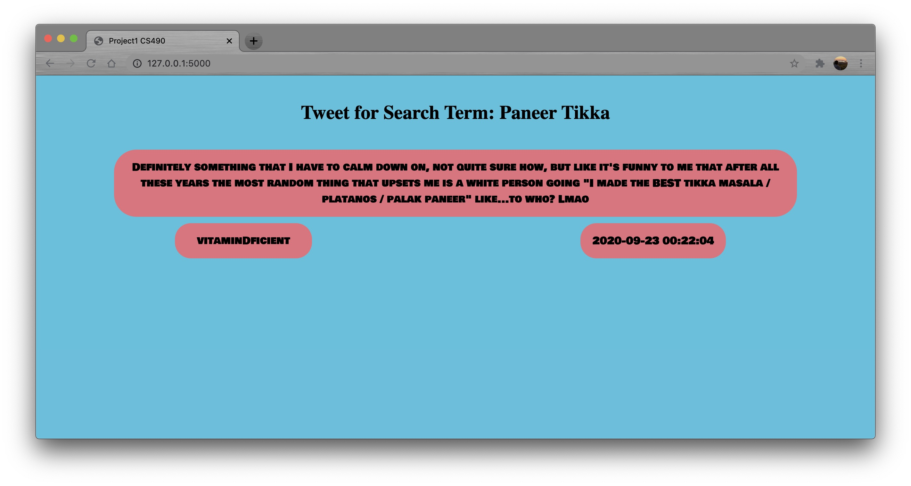

# project1-kmp87 
     
<br />

##Requirements
To run this project we need API keys for twitter which we can get by signing up into
 twitter developer portal at https://developer.twitter.com  

## Installation
Clone this repository at <br />
https://github.com/NJIT-CS490/project1-kmp87.git

Create .env file at root folder and paste the following lines 
with your unique keys and tokens in the 'key' part and source the file after modified.
```
CON_KEY=key
CON_SECRET=key
ACCESS_TOKEN=key
ACCESS_SECRET=key
```
Run the following commands to install the required library for this project.
```
pip3 install -U python-dotenv
sudo pip3 install flask 
sudo pip3 install tweepy  
```

##Run
Run the project using 
```
python main.py
```
 View this webpage at http://127.0.0.1:5000/
 
 ###Issues
 - Accessing tweets with cursor was initially giving me retweets in some searches with regular tweets. I fixed this issue 
 by adding filter to search term to filter retweets.
     ```
      Cursor(auth_api.search, tweet_mode="extended", q=dish + '-filter:retweets', lang="en").items(50)
     ``` 
 ###Known Problems
 - None
 