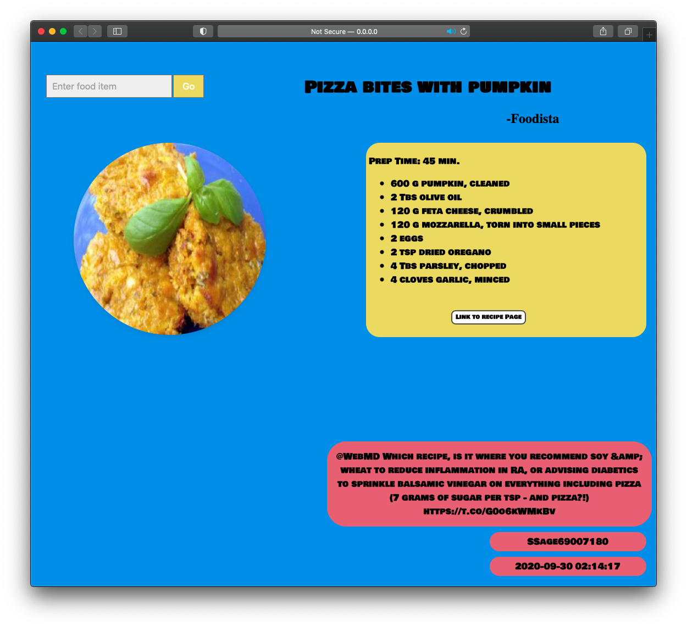

# project1-kmp87 
     
<br />

## Requirements
- To run this project we need API keys for twitter which we can get by signing up into
 twitter developer portal at https://developer.twitter.com  
- We also need API key for spoonacular to get Recipe Information from https://spoonacular.com/food-api/console#Profile
- python 3.6 (min)

## Installation
Clone this repository at <br />
https://github.com/NJIT-CS490/project1-kmp87.git

Create .env file at root folder and paste the following lines 
with your unique keys and tokens in the 'key' part and source the file after modified.
```
CON_KEY=key
CON_SECRET=key
ACCESS_TOKEN=key
ACCESS_SECRET=key
SPOONACULAR_KEY=key
```
Run the following commands to install the required library and tools for this project.
```
pip3 install -U python-dotenv
sudo pip3 install flask 
sudo pip3 install tweepy  
brew tap heroku/brew && brew install heroku
```

## Running Locally
Run the project using 
 ```
python3 main.py
```
 View this webpage at ```http://0.0.0.0:8080/``` on your browser
 
## Deploy to Heroku
- Follow this [step](https://devcenter.heroku.com/articles/creating-apps) to create a project in Heroku
- To deploy your application, [follow this](https://devcenter.heroku.com/articles/git)

 ### Issues
 - Accessing tweets with cursor was initially giving me retweets in some searches with regular tweets. I fixed this issue 
 by adding filter to search term to filter retweets.
     ```
      Cursor(auth_api.search, tweet_mode="extended", q=dish + '-filter:retweets', lang="en").items(50)
     ``` 
 - At first I implemented one api call using parameter 'addRecipeInformation=True' in the get request, but I didn't 
 required ingredients. I used spoonacular [documentation](https://spoonacular.com/food-api/docs) to get familiarize with other get requests.
  So I fixed this issue by changing my code to do second api call with recipe ID from the first 
 call which looks like this:
     ```
    https://api.spoonacular.com/recipes/RECIPE_ID/information?includeNutrition=false"
    ```
 - I implemented search box for searching recipe but I saw an issue where after first POST request,
 webpage was storing the form value which caused rendering of same search term when page refreshed.
 I fixed this issue by checking if its POST only then get search term from form else render random recipe on reload.
 
 ### Known Problems
 - No issues with any requirements for M2
 - There exist a problem with search box which gives an error when there are zero 
  recipes found. I would try to redirect the page on error to either display random recipe
  or display message showing 'No recipes found'
 - If I had more time I could make page more responsive by including bootstrap which  would give consistence 
 page at all sizes.
 
